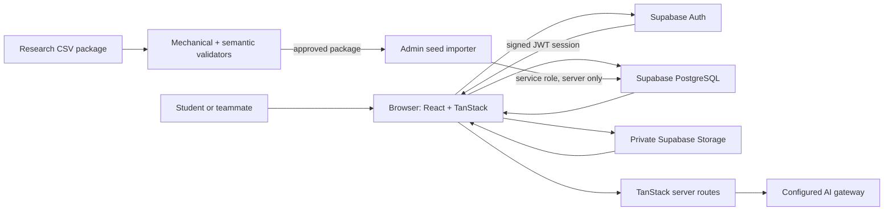
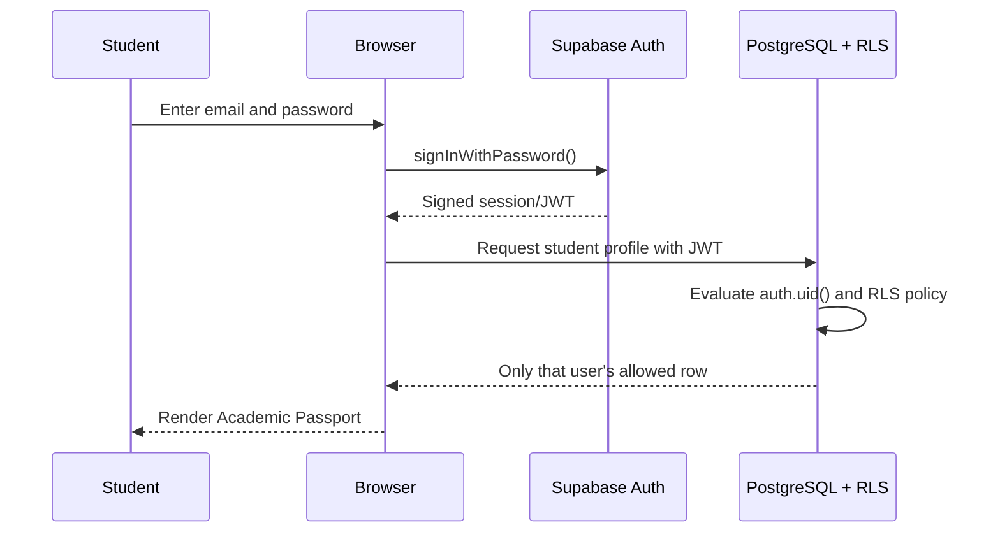
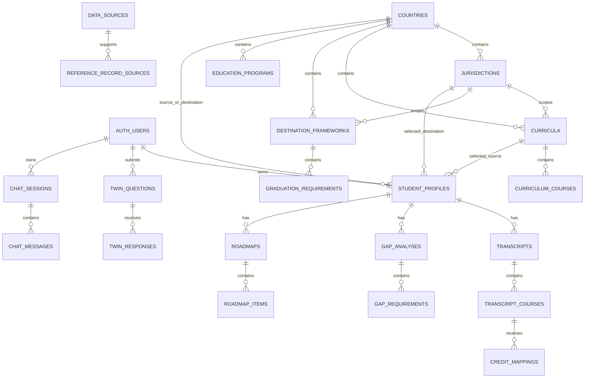
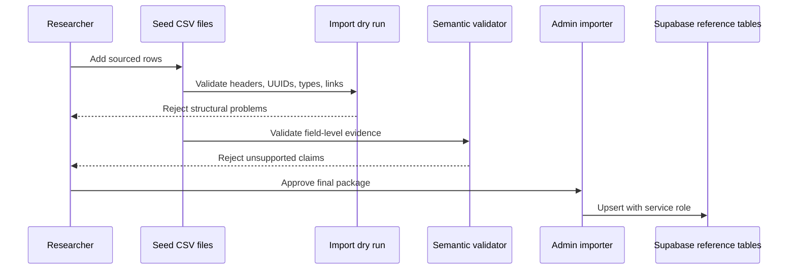
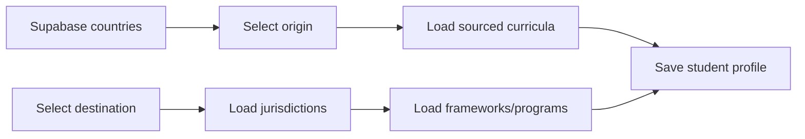

# Scholaport Reference-Data Foundation Progress Report

**Report date:** June 23, 2026  
**Project:** Scholaport MVP  
**Starting point:** The global reference-data foundation follow-up prompt supplied by the user  
**Current scope:** Database structure, reference-data research workflow, CSV seed package, validation, onboarding integration, coverage visibility, and country-by-country verification

## Important note about this report

This report was reconstructed from:

- the original follow-up prompt;
- the current repository files;
- the Supabase migrations;
- the seed templates and seed package;
- the import and semantic-validation scripts;
- the current frontend implementation;
- the completed country-validator results; and
- the research/audit history created during this work.

Most of this repository is currently uncommitted or untracked in Git, so this is a verified **current-state implementation report**, not a perfect line-by-line Git diff from a clean historical commit.

This report is now a living project record. It is updated after each completed Scholaport task so the team has one current explanation of scope, implementation, validation, and remaining work.

---

## 1. Simple summary

The original request was to stop treating education-system information as hardcoded demo content and build a real, source-tracked global reference-data foundation for Scholaport.

Since that request, the project has gained:

1. A Supabase schema for countries, jurisdictions, curricula, courses, graduation frameworks, requirements, programs, mapping rules, and source provenance.
2. Row Level Security and public-read policies for non-private reference data.
3. Google Sheets-compatible CSV templates for research and review.
4. A TypeScript import tool that validates the entire CSV package before it can be imported.
5. A second semantic validator that checks whether every retained factual field has direct evidence.
6. Seed rows for all 20 priority countries.
7. A reference-data API layer used by the frontend.
8. An onboarding flow that loads countries, curricula, jurisdictions, frameworks, and programs from Supabase rather than inventing options.
9. An internal coverage page showing exactly what data exists.
10. A research-gap system that records missing information instead of fabricating it.
11. Completed, zero-error country passes for ten countries, including Mexico, the Philippines, and Pakistan.
12. A reduced beta scope: five core source countries and five core destination countries, with already-verified Canada and Australia retained as additional destinations.

The main result is not “we have every education rule in the world.” The result is that Scholaport now has a structured system for distinguishing:

- sourced information;
- partially covered information;
- placeholders;
- information that needs more research; and
- information that must not be shown as official.

---

## 2. What the repository looked like at the start of this follow-up

At the beginning of the reference-data task:

- Scholaport already had its polished UI and routes.
- Supabase authentication and the broader student-data foundation existed or were being connected.
- The app could fail when expected Supabase tables were missing.
- Education-system information was still mostly demo or hardcoded information.
- There was no complete global reference schema used by onboarding.
- There was no standardized provenance model connecting each factual record to its source.
- There was no safe CSV import pipeline.
- There was no semantic validator checking whether a source actually supported a specific field.
- There was no internal page showing real coverage by country.
- The 20-country MVP list had not been converted into a complete, importable reference package.

---

## 3. Supabase reference-data database foundation

### Main migration added

The global reference schema is defined in:

```text
supabase/migrations/202606200001_global_reference_foundation.sql
```

### Reference tables created

The migration creates these ten tables:

1. `countries`
2. `jurisdictions`
3. `curricula`
4. `curriculum_courses`
5. `destination_graduation_frameworks`
6. `graduation_requirements`
7. `education_programs`
8. `mapping_rules`
9. `data_sources`
10. `reference_record_sources`

### What those tables mean in simple language

| Table | Purpose |
|---|---|
| `countries` | The 20 priority countries and their source/destination rankings. |
| `jurisdictions` | States, provinces, territories, regions, boards, districts, and similar local authorities. |
| `curricula` | National, regional, state-board, exam-board, vocational, or advanced curriculum systems. |
| `curriculum_courses` | Courses or official subject labels belonging to a curriculum. |
| `destination_graduation_frameworks` | A destination jurisdiction's credential or graduation structure. |
| `graduation_requirements` | Subject, credit, examination, language, or local requirements inside a framework. |
| `education_programs` | Programs such as vocational pathways, dual enrollment, or advanced programs when directly supported. |
| `mapping_rules` | Future source-to-destination equivalency rules. This is intentionally empty today. |
| `data_sources` | Official documents, ministry pages, regulations, PDFs, APIs, or reviewed sources. |
| `reference_record_sources` | Field-level links connecting a database record to its supporting source. |

### Student profile connections

The migration adds reference IDs to `student_profiles`:

- `source_country_id`
- `source_curriculum_id`
- `destination_country_id`
- `destination_jurisdiction_id`
- `destination_framework_id`

This allows a student's Academic Passport to point to real reference records instead of storing only free-text labels.

### Constraints and integrity rules

The migration includes:

- UUID primary keys;
- country ISO2 and ISO3 format checks;
- coverage-status constraints;
- jurisdiction-type constraints;
- curriculum-type constraints;
- program-scope constraints;
- mapping-confidence constraints;
- source-reliability constraints;
- foreign keys between all related tables; and
- automatic `updated_at` triggers.

### Indexes added

Indexes were added for the requested lookup patterns, including:

- country ISO codes;
- jurisdiction country, parent, and type;
- curriculum country, jurisdiction, and type;
- course curriculum, subject, and grade;
- framework country and jurisdiction;
- requirement framework and subject;
- program country and type;
- mapping source/destination countries and subjects;
- source country, jurisdiction, and reliability; and
- provenance table name plus record ID.

Unique identity indexes also help prevent duplicate countries, jurisdictions, source URLs, and provenance links.

### RLS and security

Row Level Security is enabled on every reference table.

The migration creates public `SELECT` policies because this reference information contains no private student data. It does **not** create public insert, update, or delete policies. Consequently:

- frontend users can read public reference data;
- ordinary browser clients cannot administer the reference package; and
- administrative imports require the server-only Supabase service role.

No service-role key is stored in frontend code.

### Initial 20-country database seed

The migration inserts all 20 priority-country shell rows with their correct source/destination priority ranks. Unsourced shells begin as `country_seed_only` with empty summaries and empty grade structures.

It also preserves Georgia as the initial US jurisdiction placeholder without claiming that old unsourced values are verified.

### Live-database caveat

The migration file exists, and it was manually run during the setup process according to the session history. However, this report does not use a service-role connection to inspect the live Supabase database.

More importantly, the newer researched CSV package has only been **dry-run validated**. It has not yet been live-imported into Supabase. Therefore the repository contains more researched data than the live database may currently contain.

---

## 4. Google Sheets-compatible research workflow

### Templates created

The following templates exist under `supabase/seed_templates/`:

- `countries_template.csv`
- `jurisdictions_template.csv`
- `curricula_template.csv`
- `curriculum_courses_template.csv`
- `destination_graduation_frameworks_template.csv`
- `graduation_requirements_template.csv`
- `education_programs_template.csv`
- `mapping_rules_template.csv`
- `data_sources_template.csv`
- `reference_record_sources_template.csv`

Every template header matches its database table.

### Workflow documentation

`supabase/seed_templates/README.md` explains that:

- Google Sheets is for research and review only;
- the live app never reads directly from Sheets;
- each sheet is exported as CSV;
- CSVs are placed in `supabase/seeds/`;
- factual records require provenance;
- unsourced country shells remain `country_seed_only`;
- unsourced detailed rows must remain `needs_research`;
- the service-role key must never be exposed with a `VITE_` prefix; and
- the dry-run validator should be executed before importing.

---

## 5. Current seed package

### Seed files

The current import package lives under `supabase/seeds/`:

- `countries.csv`
- `jurisdictions.csv`
- `curricula.csv`
- `curriculum_courses.csv`
- `destination_graduation_frameworks.csv`
- `graduation_requirements.csv`
- `education_programs.csv`
- `mapping_rules.csv`
- `data_sources.csv`
- `reference_record_sources.csv`

### Current mechanical snapshot

As of the final read-only snapshot for this report:

| Table | Rows accepted | Rejected |
|---|---:|---:|
| Countries | 20 | 0 |
| Jurisdictions | 122 | 0 |
| Data sources | 65 | 0 |
| Curricula | 46 | 0 |
| Curriculum courses | 39 | 0 |
| Destination graduation frameworks | 10 | 0 |
| Graduation requirements | 8 | 0 |
| Education programs | 12 | 0 |
| Mapping rules | 0 | 0 |
| Provenance links | 299 | 0 |

These counts reflect the completed Mexico repair. Older research reports may contain earlier snapshots.

### Mapping rules remain empty intentionally

`mapping_rules.csv` contains only its header.

This is deliberate. No cross-country course equivalency is being claimed until authoritative guidance or a separately reviewed mapping methodology exists. Scholaport must not infer credit equivalency from course names alone.

---

## 6. Import and mechanical validation tooling

### Import script

The TypeScript import tool is:

```text
scripts/import-reference-data.ts
```

### Package commands

```text
npm run seed:reference
npm run seed:reference:check
npm run seed:reference:check:country -- --country=USA
```

### What the importer validates

Before any database write, it validates:

- exact CSV headers;
- required fields;
- UUID format;
- booleans, numbers, integers, arrays, and JSON;
- allowed coverage statuses;
- allowed enum values;
- country-shell rules;
- foreign-key-style relationships across the CSV package;
- source-link targets;
- duplicate identities; and
- required provenance for retained factual data.

### Dry-run mode

The dry-run mode reads and validates the complete package without connecting to Supabase.

This is how the package can be safely repaired before any live import.

### Live-import security

A real import requires:

- `SUPABASE_URL`; and
- `SUPABASE_SERVICE_ROLE_KEY`.

Those values belong in a local `.env.seed.local`, never in browser code or committed source.

---

## 7. Semantic source validation

### Why mechanical validation was not enough

A CSV can be structurally valid while still containing a false or overbroad claim. For example:

- a ministry homepage may exist but not support a specific credit requirement;
- a district policy may not prove a statewide rule;
- a curriculum subject may exist without being mandatory;
- a qualification may not be a graduation framework; or
- an examination may be for university admission rather than graduation.

### Semantic validator created

The second validator is:

```text
scripts/validate-semantic-reference-audit.ts
```

It checks `SEMANTIC_SOURCE_AUDIT.csv` against the seed package.

### What it enforces

For retained `partial`, `verified`, or `official` records, it checks that every important populated field has:

- a source URL;
- a source that exists in `data_sources.csv`;
- an exact source section or page;
- a claim summary;
- direct-support confirmation;
- scope-match confirmation;
- current-applicability confirmation; and
- a matching record and field.

It also rejects:

- duplicate audit tuples;
- audit rows targeting missing records;
- unsupported table or field names;
- fake/non-HTTP URLs; and
- retained claims without complete support.

### Meaning of “zero errors”

Zero errors does **not** mean that every possible fact for a country has been collected.

It means that every factual field Scholaport decided to retain for that country has a valid evidence trail. Missing information remains absent or is documented in `RESEARCH_GAPS.csv`.

---

## 8. Frontend reference-data API

### Main data layer

The typed reference API is implemented in:

```text
src/lib/reference-api.ts
```

### Functions implemented

The requested data functions now exist:

- `getPriorityCountries()`
- `getSourceCountries()`
- `getDestinationCountries()`
- `getCountryEducationProfile(countryId)`
- `getJurisdictions(countryId)`
- `getCurricula(countryId, jurisdictionId?)`
- `getCurriculumCourses(curriculumId)`
- `getDestinationFrameworks(countryId, jurisdictionId?)`
- `getGraduationRequirements(frameworkId)`
- `getEducationPrograms(countryId, jurisdictionId?)`
- `getMappingRules(filters)`
- `getDataSourcesForRecord(tableName, recordId)`

The same module also builds the internal reference-coverage summary.

### Type validation

Supabase results are checked with Zod schemas. This prevents malformed database rows from silently entering the UI.

### Honest filtering

Detailed functions only return records with usable evidence statuses:

- `partial`
- `verified`
- `official`

Rows marked `needs_research`, `not_verified`, or `country_seed_only` are not presented as confirmed detailed requirements.

---

## 9. Onboarding now uses reference data

### File updated

```text
src/routes/onboarding.tsx
```

### Real data now loaded

Onboarding loads from Supabase:

- source countries;
- destination countries;
- source curricula;
- destination jurisdictions;
- destination graduation frameworks; and
- destination programs.

### Profile relationships saved

When onboarding completes, the student profile stores both readable names and reference IDs, including country, curriculum, jurisdiction, and framework IDs.

### Honest empty states

If detailed data does not exist, onboarding says so. Examples include:

- “More detailed local curriculum data is coming soon.”
- “No local data available.”
- “No verified framework available.”
- “Not enough verified local data yet.”

The student can type a self-reported curriculum or program, but the UI clearly distinguishes that from verified reference data.

### What was intentionally avoided

The onboarding flow does not invent:

- US states that are absent;
- curricula that were not imported;
- graduation frameworks;
- school programs; or
- official requirements.

---

## 10. Internal Reference Data Coverage page

### Route added

```text
/reference-coverage
```

### File

```text
src/routes/reference-coverage.tsx
```

### What it displays

For each country, the page shows:

- source/destination priority;
- jurisdiction count;
- curriculum count;
- curriculum-course count;
- graduation-framework count;
- requirement count;
- program count;
- source count; and
- coverage status.

Zero counts are shown intentionally rather than hidden. This gives the team a factual view of what has and has not been researched.

---

## 11. Research and provenance system

### Main files

```text
SEMANTIC_SOURCE_AUDIT.csv
RESEARCH_GAPS.csv
RESEARCH_AUDIT.md
```

### Semantic audit

The current `SEMANTIC_SOURCE_AUDIT.csv` contains **264 audit rows**.

These rows record field-level evidence and corrections. They are separate from the production database seed because they are primarily an internal quality-control artifact.

### Research gaps

`RESEARCH_GAPS.csv` currently contains **153 documented gaps**.

Examples include:

- the remaining US state frameworks;
- German Land-specific curricula;
- province-specific Chinese examination rules;
- Canadian province/territory frameworks;
- Australian state credentials;
- board- and subsystem-specific course catalogs;
- international curricula;
- vocational pathways; and
- cross-system mapping rules.

These gaps are not failures. They prevent uncertain information from being misrepresented as fact.

### Existing research documents

Several research and repair reports were produced during the multi-stage process, including regional audits and country-specific repair prompts. They are useful as working history but are not all synchronized to the latest row counts.

For example, `RESEARCH_AUDIT.md` still describes the earlier nine-row China version, while the current validated China package contains thirteen course rows and 36 supported claims. The current seed files and validator output should be treated as the authoritative state.

---

## 12. Country-by-country work completed

### Current status overview

| Country | Status | Supported claims | Errors | Practical meaning |
|---|---|---:|---:|---|
| United States | Complete for current scope | 58 | 0 | National decentralization plus Georgia detail are sourced. |
| India | Complete for current scope | 86 | 0 | CBSE-focused records are sourced; broader boards remain gaps. |
| Canada | Complete for current scope | 14 | 0 | National decentralization and Ontario-scoped records are sourced. |
| Australia | Complete for current scope | 21 | 0 | NSW, Victoria, and scoped program records are sourced. |
| United Kingdom | Complete for current scope | 11 | 0 | Devolved structure and narrowed England/Scotland curriculum records are sourced. |
| Germany | Complete for current scope | 3 | 0 | Country/KMK coordination is sourced; Länder details remain research placeholders. |
| China | Complete for current scope | 36 | 0 | Three national curriculum programs and 13 subject labels/translations are sourced. |
| Mexico | Complete for current scope | 14 | 0 | National legal/curriculum records are directly sourced; local implementation detail remains a research gap. |
| Philippines | Complete for current scope | 8 | 0 | Incoming Grade 11 Academic/TechPro transition scope is sourced; broader JHS, Grade 12, credential, assessment, and TESDA detail remains research work. |
| Pakistan | Complete for current scope | 8 | 0 | Two FBISE scheme rows are limited to affiliated institutions and the 2025/2026 transition; provincial and other-board systems remain gaps. |
| Saudi Arabia | Complete for current scope | 3 | 0 | Secondary pathways system is sourced; broader curriculum, examination, and recognition detail remain research gaps. |
| United Arab Emirates | Complete for current scope | 0 | 0 | No directly sourced detailed curriculum, framework, or requirement rows retained; country and emirate jurisdictions preserved as honest placeholders with documented research gaps. |

### United States and Georgia

Major repairs included:

- replacing district-level evidence with direct Georgia State Board of Education rules;
- correcting Georgia's framework to 23 Carnegie units;
- reducing 11 incorrect requirement rows to 8 correctly structured requirements;
- combining CTAE/Modern Language/Latin/Fine Arts correctly;
- combining Health and Physical Education correctly;
- removing a nonexistent community-service credit requirement;
- correcting examination language; and
- narrowing AP and dual-enrollment claims to what official sources support.

Only Georgia has detailed verified state coverage. The other states remain jurisdiction placeholders.

### India

The India pass:

- preserved India as a country shell instead of inventing one universal profile;
- updated CBSE research to the current curriculum year used in the audit;
- retained 26 supported CBSE course rows;
- cleared unsupported codes, required/exam claims, and descriptions where necessary;
- downgraded unsupported CISCE, NIOS, and state-board details; and
- documented IB, matriculation, and other board/pathway gaps.

### Canada and Ontario

The Canada pass:

- modeled education as provincial/territorial rather than national;
- corrected province/territory types and authority names;
- narrowed the Ontario curriculum record;
- sourced the Ontario Secondary School Diploma framework;
- represented cohort complexity cautiously; and
- avoided creating misleading requirement rows where the current schema could not safely represent every cohort rule.

### Australia

The Australia pass:

- corrected ACT and Northern Territory jurisdiction types;
- replaced generic ACARA links for state-specific claims;
- narrowed NSW HSC and Victorian VCE records;
- removed misleading ATAR-as-graduation language;
- clarified examination scope;
- correctly scoped VCE Vocational Major to Victoria; and
- deleted the SACE VET Register program row because a recognition register is not an education program.

### United Kingdom

The UK pass:

- rewrote the country summary around devolved systems;
- cleared a misleading unified grade structure;
- corrected the four constituent-system authority records;
- narrowed England to the England National Curriculum;
- narrowed Scotland to Curriculum for Excellence Senior Phase;
- deleted England/Scotland “graduation framework” rows that falsely combined subject qualifications into diploma-style frameworks; and
- deleted GCSE, A-Level, and BTEC “program” rows that were misclassified qualifications.

### Germany

The Germany pass:

- retained only a sourced country-level explanation of Länder responsibility and KMK coordination;
- kept all 16 Länder as `needs_research` placeholders;
- downgraded the old KMK curriculum/framework details;
- removed generic unused source provenance; and
- avoided claiming a federal German curriculum or federal Abitur framework.

Some Länder authority labels may still be historically stale. They remain explicitly `needs_research` and should be refreshed during a future Länder metadata pass.

### China

The China pass:

- downgraded the broad country profile to `country_seed_only`;
- replaced generic MOE evidence with direct official Chinese documents;
- corrected the compulsory-education curriculum to the full nine-year 2022 program;
- narrowed the senior-high record to the exact 2017/2020 program;
- narrowed vocational coverage to the public basic curriculum for secondary vocational education;
- replaced 28 speculative grade-specific course rows with 13 consolidated official subject rows;
- cleared unsupported grade, required, examination, credit, outcome, and description fields;
- added clearly labeled descriptive English translations; and
- documented provincial Gaokao, Zhongkao, credentials, language-medium, and implementation differences as future research.

### Mexico — complete for current scope

The completed Mexico repair uses:

- the current General Education Law;
- the 2022 Basic Education Study Plan/Fase 6;
- the current 2025 MCCEMS agreement; and
- the CONALEP 2025–2030 institutional program.

Mexico now validates at **14 required claims, 14 supported claims, and 0 errors**. Its mechanical package also has 0 rejected rows. The pass preserved every non-Mexico row byte-for-byte, left `mapping_rules.csv` empty, and did not import or deploy anything.

---

## 13. Current beta country scope and remaining dedicated passes

On June 23, 2026, the MVP scope was intentionally reduced to five source countries and five destination countries. Existing verified work is preserved internally; Canada and Australia are hidden from MVP 1 onboarding for later expansion.

### Core source countries visible in onboarding

- India — complete
- China — complete
- Mexico — complete
- Philippines — complete for the current incoming Grade 11 transition scope
- Pakistan — complete for the current FBISE-affiliate/session scope

### Core destination countries visible in onboarding

- United States — complete for the current Georgia-focused scope
- Germany — complete for the current national/KMK scope
- Saudi Arabia — complete for the current secondary-pathways scope
- United Kingdom — complete for the current devolved-system scope
- United Arab Emirates — complete for current scope (honest placeholder; no unsupported detailed rows retained)

### Verified destinations retained internally but hidden in MVP 1

- Canada — complete for the current Ontario-focused scope
- Australia — complete for the current NSW/Victoria-focused scope

The app exposes **exactly 5 source choices and 5 destination choices**. Canada and Australia remain in the reference package but are excluded by the centralized MVP 1 allowlist. Saudi Arabia and the United Arab Emirates have completed their scoped passes.

The remaining original priority countries stay safely in the database and research backlog but are hidden from user-facing onboarding until the team deliberately expands the beta:

- Bangladesh
- Ukraine
- Russia
- Egypt
- Nigeria
- France
- Spain
- Italy

Some of these countries already contain old `partial` seed rows, but those rows must not be trusted merely because they exist. Each country must receive the same direct-source and field-level audit process.

---

## 14. What is real now versus what is not

### Real and implemented in the repository

- Reference database migration
- RLS and read policies
- All 20 country shells and research records retained internally
- User-facing beta allowlists for exactly 5 source countries and 5 destination countries
- CSV templates
- Import script
- Mechanical package validation
- Semantic field-level validation
- Typed frontend data layer
- Supabase-powered onboarding queries
- Honest onboarding empty states
- Internal coverage page
- Ten completed country passes
- Research gap tracking
- Buildable TypeScript application

### Not yet complete

- Two remaining core-beta country semantic passes
- Live import of the latest researched CSV package
- Detailed coverage for every state/province/territory
- Full course catalogs
- Official cross-country credit mappings
- AI credit mapping
- OCR/transcript parsing
- Full RAG advisor
- Counselor packet PDF generation
- Complete PathMatch data and algorithms
- Twin Connect production moderation

---

## 15. Current quality-check results

### Passing

- Mechanical reference-package dry run: **passed with 0 rejected rows**
- TypeScript typecheck: **passed**
- Production client build: **passed**
- Production SSR build: **passed**
- Eleven completed country semantic validators: **passed with 0 errors**

### Current lint status

The two Prettier formatting errors previously reported in `scripts/validate-semantic-reference-audit.ts` have been fixed. Lint now has **0 errors** and **16 existing React Fast Refresh warnings** across component files. The warnings do not block typechecking or production builds.

### Build warnings

The build also displays non-blocking notices about:

- no Lovable context being present; and
- Vite now supporting TypeScript path resolution natively.

These notices do not break the build.

---

## 16. Why this work matters for the MVP

Without this system, Scholaport could accidentally show a student:

- a district rule as a statewide rule;
- an entrance examination as a graduation requirement;
- an unsupported course equivalency;
- an outdated curriculum;
- a national rule that actually varies by province or state; or
- a fake “official” program assembled from marketing pages.

The new foundation forces the application to say “not enough verified local data yet” when evidence is incomplete.

For a product advising international-transfer students, that honesty is a core safety feature, not merely a database detail.

---

## 17. Recommended next steps

### Immediate

1. Fix the two validator formatting errors so lint has no errors.
2. Keep the beta country allowlists synchronized with the team's support commitment.

### Complete the MVP country foundation

3. ~~Run one Codex country pass at a time for Saudi Arabia and the United Arab Emirates.~~ **Done** — both passes completed with 0 errors.
4. Run the global semantic validator for the full beta-visible set.
4. After those two are processed, run the global semantic validator for the full beta-visible set.
6. Resolve any cross-country duplicate UUIDs or provenance conflicts.
7. Update `RESEARCH_AUDIT.md` so its counts match the final seed package.

### Move researched data into the live application

8. Create a secure local `.env.seed.local` with the Supabase URL and server-only service-role key.
9. Run the final dry run again.
10. Run the controlled live seed import once.
11. Verify table counts in Supabase.
12. Test onboarding for at least one country at every coverage level.
13. Test `/reference-coverage` against the live data.

### After the MVP foundation

14. Work through high-priority items in `RESEARCH_GAPS.csv` based on beta-user needs.
15. Build credit-mapping logic only after the reference inputs and counselor-review rules are stable.
16. Keep all automated mappings explicitly probabilistic and reviewable.

---

## 18. Bottom line

The reference-data task has produced a substantial real foundation, not merely more demo content.

Scholaport now has:

- a real database model;
- a safe administrative import path;
- source and field-level provenance;
- honest coverage states;
- live frontend queries;
- country-aware onboarding;
- an internal coverage dashboard; and
- a repeatable country-validation workflow.

The work is not finished. Ten countries are complete for their current scoped coverage, and two more country passes remain for the chosen beta-visible set. The other original countries remain preserved as future research rather than being marketed as supported. The latest researched CSV package has also not yet been imported into the live Supabase database.

That is the exact current position: the architecture is built, the validation system works, the application builds, and the team is now completing and verifying the country data one country at a time.

---

# Appendix A — Work Completed Before the Global Reference-Data Prompt

This appendix extends the report backward to the beginning of the Scholaport/Courseport conversation. Nothing in the preceding report has been removed or rewritten.

## A1. Initial product request and technical specification

The conversation began with a request to build a web-first MVP from the supplied technical specification PDF and product logo.

The initial product concept was an “academic passport” for internationally transferring students. Its intended workflow included:

- identifying a student's origin country and curriculum;
- uploading a transcript;
- translating courses into a destination context;
- showing probable credit mappings;
- identifying graduation gaps;
- building an academic roadmap;
- helping students ask questions through an advisor;
- connecting students to relevant paths and mentors; and
- creating a counselor-ready transfer packet.

The requested design direction was:

- passport and international-journey themed;
- educational but not childish;
- modern, high-tech, and professional;
- rounded and approachable;
- clean enough to resemble a venture-backed startup; and
- based on the navy, teal, white, and coral logo palette.

The project was originally referred to as Courseport and previously contained EduBridge naming inherited from the Lovable prototype.

## A2. Existing polished frontend and route system

The current application contains the main web routes requested for the MVP:

```text
/
/login
/onboarding
/transcript
/gaps
/roadmap
/advisor
/pathmatch
/twins
/guide
/packet
/profile
/reference-coverage
```

There are also chat routes and server/API routes used by the TanStack Start application.

The major user-facing screens include:

- Academic Passport dashboard
- Transcript upload and transcript-course view
- Gap analysis
- Academic roadmap
- Advisor conversation
- PathMatch
- Twin Connect
- School survival guide
- Counselor packet preview
- Student profile and preferences
- Authentication
- Three-step onboarding
- Internal reference coverage

The UI, layout, and core design system were preserved while the underlying data layer was progressively replaced.

## A3. Product logo and brand replacement

The original Courseport logo supplied by the user was added to the application and later carried into the Scholaport brand.

The current brand asset is:

```text
src/assets/scholaport-logo.png
```

The reusable logo component is:

```text
src/components/ScholaportLogo.tsx
```

The old EduBridge product identity was removed from user-facing branding. Page titles, metadata, authentication copy, shells, and navigation now use **Scholaport**.

The root metadata currently identifies the product as:

```text
Scholaport — Your academic passport
```

## A4. Application text inventory

At the user's request, a separate Markdown inventory of the words and content displayed throughout the application was created:

```text
app_content.md
```

It contains route- and component-organized text from the application, including:

- dashboard content;
- authentication copy;
- onboarding copy;
- roadmap content;
- transcript content;
- advisor prompts;
- guide content;
- gaps content;
- PathMatch content;
- counselor packet content;
- profile content;
- Twin Connect content; and
- shared shell/error copy.

This made it possible to review product language independently from the visual UI.

## A5. Rename from Courseport to Scholaport

The product was renamed from Courseport to **Scholaport** after the initial UI work.

The rename affected:

- page titles;
- browser metadata;
- login and onboarding copy;
- dashboard and shell branding;
- error messages;
- the reusable logo component;
- Cloudflare Worker naming;
- documentation; and
- newer data-layer and API file names.

Some filesystem history and the parent folder still use older names such as `courseport` or `edubridge-ai-`. These are development-directory names, not current product branding.

## A6. Supabase environment and client foundation

### Client file

The browser Supabase client is implemented in:

```text
src/lib/supabase.ts
```

It uses environment variables rather than hardcoded credentials:

```text
VITE_SUPABASE_URL
VITE_SUPABASE_ANON_KEY
```

### Graceful missing-configuration behavior

When those variables are absent, the app shows a clear connection message rather than silently loading fake student data.

The application explicitly states that it does not use demo fallback data when the backend is unavailable.

### Environment example

`.env.example` documents:

- public Supabase configuration;
- development-access and Google-auth flags;
- server-only reference-import configuration;
- future AI/OCR integration variables; and
- upload/server settings.

Private service-role or AI keys are not placed in browser-visible variables.

## A7. Authentication foundation

### Authentication provider

Session and profile state are managed by:

```text
src/components/AuthProvider.tsx
```

It tracks:

- the Supabase session;
- the authenticated user;
- the student's profile;
- loading state;
- account-loading errors;
- profile refresh; and
- sign out.

### Email/password authentication

The existing login page was connected to Supabase Auth and supports:

- email/password registration;
- email/password login;
- confirmation guidance when email confirmation is required;
- successful-login navigation; and
- error handling.

### Google authentication

Google OAuth support was added to the login page through Supabase's OAuth flow.

The UI is feature-flagged using:

```text
VITE_ENABLE_GOOGLE_AUTH
```

The default documented value is `false`, allowing the OAuth integration to remain in the code without forcing it into the active development or staging flow.

Google Cloud/Supabase provider configuration was discussed and partially configured manually outside the repository. The presence of the code does not by itself prove that every external Google OAuth setting is currently production-ready.

### Local development access

A local-only development-access button was added. It uses an isolated anonymous Supabase user and is available only when both conditions are true:

```text
import.meta.env.DEV
VITE_ENABLE_DEV_ACCESS=true
```

This allows the developer to inspect authenticated flows locally without repeatedly creating personal accounts.

The button does not appear in a production build when `VITE_ENABLE_DEV_ACCESS=false`.

### Current recommended flags

The documented safe staging defaults are:

```text
VITE_ENABLE_DEV_ACCESS=false
VITE_ENABLE_GOOGLE_AUTH=false
```

Local development can enable developer access separately.

## A8. Protected routing and account-state behavior

Authentication and onboarding protection are implemented in the root route.

The app now follows these rules:

1. Unauthenticated users are sent to `/login`.
2. Authenticated users without a student profile are sent to `/onboarding`.
3. Authenticated users with a profile can use the main application.
4. Users with completed profiles are redirected away from login/onboarding to the dashboard.
5. Missing Supabase configuration shows a clear setup state.
6. Account/profile errors show an explicit error page instead of invented content.

This explains why signing into a new Google or email account can immediately lead to onboarding: that account has no `student_profiles` row yet.

## A9. Student profile and onboarding persistence

The three-step onboarding flow was connected to Supabase.

It stores student details including:

- first name;
- optional last name;
- origin country;
- source curriculum;
- destination country;
- destination jurisdiction/target state;
- optional target school;
- grade at transfer;
- expected graduation year;
- optional target program;
- preferred language; and
- reference IDs for country, curriculum, jurisdiction, and framework.

The profile page loads the authenticated student's real profile, supports editing, saves updates to Supabase, and includes sign out.

Profile-level information is no longer presented as a fixed “Maya Patel” demo identity.

## A10. Authenticated student-data database foundation

Two earlier migrations support the authenticated application:

```text
supabase/migrations/202606190001_scholaport_mvp.sql
supabase/migrations/202606190002_authenticated_foundation.sql
```

Together they define or extend tables for:

- profiles and student profiles;
- transcripts and transcript courses;
- credit mappings;
- US states and state requirements;
- gap analyses and gap requirements;
- roadmaps and roadmap items;
- PathMatch paths and matches;
- Twin Connect mentors, questions, and responses;
- guide topics and articles;
- advisor chat sessions and messages; and
- counselor packets.

### User ownership

User-owned tables have RLS policies tying access to `auth.uid()` either directly or through the student's related profile/session.

### Shared/public content

Separate read policies exist for appropriate shared content, such as:

- verified mentor profiles;
- published guide topics/articles;
- verified PathMatch paths; and
- public state-reference information.

## A11. Typed Scholaport data-access layer

The authenticated application data layer is implemented in:

```text
src/lib/scholaport-api.ts
```

It includes strict Zod schemas and functions for:

- current profile retrieval;
- profile upsert;
- passport summary;
- transcript courses;
- credit mappings;
- gap analysis;
- roadmap retrieval;
- roadmap-item status updates;
- PathMatch paths;
- Twin Connect mentors;
- Twin question submission;
- pending Twin questions;
- guide topics and articles;
- advisor message history;
- advisor message persistence; and
- transcript file/metadata upload.

The dashboard, transcript, roadmap, profile, Twin Connect, guide, advisor, packet, and gap screens use this Supabase data layer to varying degrees.

## A12. Dashboard and profile conversion from demo data

The dashboard now reads the authenticated student's profile and associated passport records.

It displays real values such as:

- the student's name;
- origin curriculum and country;
- target state/country;
- target school;
- grade and graduation year;
- transcript upload status;
- gap-analysis status; and
- saved roadmap items.

When data does not exist, it displays honest empty states such as:

- no transcript uploaded;
- no roadmap generated; or
- no gap analysis available.

It does not fabricate progress to keep the dashboard visually full.

## A13. Roadmap persistence

Roadmap records and roadmap items are stored in Supabase.

The roadmap page:

- loads the authenticated user's roadmap;
- displays real saved items;
- updates item completion/status in `roadmap_items`; and
- reloads the persisted state through React Query.

The completion state is no longer intended to depend only on browser `localStorage`.

The application does not yet generate a real roadmap from OCR or an automated gap-analysis engine. It persists roadmap records when they exist.

## A14. Twin Connect question persistence

Twin Connect now:

- loads verified mentor records from Supabase;
- saves submitted questions to `twin_questions`;
- records the selected prompt;
- records anonymous preference;
- sets moderation status;
- displays a success toast; and
- reloads the user's pending-moderation questions.

Production moderation workflows and mentor-response operations are still future work.

## A15. Advisor chat persistence

The advisor page now:

- loads previous messages from Supabase;
- creates or reuses a chat session;
- saves user messages;
- saves assistant messages;
- restores conversation history after refresh; and
- passes authenticated profile context to the advisor endpoint.

The project retains a fallback/rule-based or non-RAG advisor path when a full AI integration is unavailable.

Full retrieval-augmented generation over official education sources has not been implemented yet.

## A16. Transcript upload and private storage foundation

The transcript page supports file selection and replacement.

The upload function:

- creates a transcript UUID;
- constructs a user-scoped storage path;
- attempts upload to the private `transcripts` bucket;
- stores original filename and MIME type;
- records storage path or storage error;
- creates the transcript metadata row; and
- records either processing or metadata-only status.

The authenticated migration creates a private Supabase Storage bucket and policies requiring files to live under the authenticated user's folder.

This is a storage/persistence foundation only. Real OCR and transcript parsing are intentionally not implemented yet.

## A17. Gap analysis behavior

The gap page reads saved gap-analysis and requirement records when they exist.

If no analysis exists, it explicitly says that uploading a transcript does not fabricate one and that the analysis will appear after the analysis service is implemented.

This is an important change from a hardcoded demo because it prevents the UI from presenting invented graduation gaps.

## A18. Guide, PathMatch, and counselor packet behavior

### Guide

Guide topics and articles are stored in Supabase and loaded through the authenticated data layer. Initial published guide content is seeded in the authenticated migration.

### PathMatch

The PathMatch screen and database tables exist. Verified paths can be publicly read, and user-specific matches have an ownership table/policy.

The full matching algorithm and fully verified story library have not been implemented.

### Counselor packet

The packet page reads the same authenticated profile, transcript, credit, gap, and roadmap records used elsewhere in the app.

It provides a print-ready preview and does not automatically send student information to a school.

Real server-generated PDF production is not implemented yet.

## A19. No-demo-fallback policy

The user explicitly rejected demo fallbacks.

The implementation now favors:

- explicit loading states;
- explicit backend-configuration errors;
- empty states when records are absent;
- `needs_research` coverage states;
- self-reported labels clearly separated from reference data; and
- no invented passport, gap, roadmap, or transcript-analysis results.

Some static interface copy and advisor starter prompts remain in code because they are UI content, not false student or curriculum records.

## A20. API route cleanup

Legacy-looking API routes such as:

```text
/api/v1/passport
/api/v1/transcripts
/api/v1/reference
```

now return `410` responses explaining that the data moved to the authenticated Supabase layer.

This prevents two competing backend architectures from silently diverging.

The advisor endpoint remains active because it performs server-side response generation and chat coordination.

## A21. Missing-table errors and migration application

During setup, the app displayed errors such as:

```text
Could not find the table 'public.student_profiles' in the schema cache
Could not find the table 'public.countries' in the schema cache
```

These messages did not mean the frontend was destroyed. They meant the local app was connected to a Supabase project where the expected SQL migrations had not yet been executed.

The migrations were opened and run through the Supabase SQL Editor during the setup process. After that, the focus moved to building and validating the seed package.

## A22. Development, staging, and teammate access strategy

The agreed development strategy became:

### Local developer environment

```text
VITE_ENABLE_DEV_ACCESS=true
VITE_ENABLE_GOOGLE_AUTH=false
```

### Private-team/staging application behavior

```text
VITE_ENABLE_DEV_ACCESS=false
VITE_ENABLE_GOOGLE_AUTH=false
```

Teammates can use normal Scholaport email/password accounts. Localhost remains accessible only on the developer's own computer.

Google OAuth remains available in code for later activation but is not required during MVP construction.

## A23. Cloudflare staging deployment

The project was configured for Cloudflare Workers using:

```text
wrangler.jsonc
```

Current Worker configuration includes:

- Worker name `scholaport-web-mvp`;
- Node.js compatibility;
- TanStack Start server entry;
- client asset binding; and
- observability.

Deployment scripts were added to `package.json`.

The staging Worker was deployed at:

```text
https://scholaport-web-mvp.scholaport-team.workers.dev
```

Cloudflare Access was explored as an outer staging login layer, but its account/payment setup added unnecessary complexity. The practical decision was to leave the Worker URL public while requiring Scholaport authentication inside the application.

“Public Worker URL” means the login page can be reached. It does not mean private student data bypasses Supabase Auth or RLS.

## A24. Current environment and secret-handling approach

Public browser configuration uses only:

- Supabase project URL; and
- Supabase publishable/anonymous key.

Sensitive values remain server-only, including:

- Supabase service-role key;
- OpenAI key;
- Mistral OCR key;
- Google Document AI configuration; and
- other future backend integration keys.

No secret or service-role key should be prefixed with `VITE_`.

## A25. What the complete conversation has accomplished

From the beginning of the conversation through the current reference-data work, Scholaport progressed through four broad stages:

### Stage 1 — Product and interface

- Established the academic-passport concept.
- Preserved and refined the polished web application.
- Added the supplied product logo and palette.
- Created all primary MVP routes.
- Created an application-content inventory.

### Stage 2 — Identity and authenticated foundation

- Renamed the product to Scholaport.
- Connected Supabase.
- Added email/password authentication.
- Added optional Google OAuth code.
- Added local developer access.
- Added protected routing.
- Persisted onboarding and profiles.
- Added RLS-protected student tables and storage.

### Stage 3 — Feature persistence

- Connected dashboard/profile data.
- Persisted transcripts and upload metadata.
- Persisted roadmap status.
- Persisted Twin Connect questions.
- Persisted advisor messages.
- Connected guide and packet screens to database records.
- Replaced fake feature results with honest empty states where generation services do not yet exist.

### Stage 4 — Global reference foundation

- Added the ten reference tables.
- Added templates, import tooling, and provenance.
- Connected onboarding to reference data.
- Added the coverage page.
- Seeded all 20 priority countries.
- Completed ten country semantic passes, including Mexico, the Philippines, and Pakistan.
- Reduced the beta-visible scope to five core source countries and five core destination countries, while retaining already-verified Canada and Australia as additional destinations.

## A26. Overall current state in one paragraph

Scholaport is no longer merely a hardcoded frontend mockup. It is a buildable, authenticated TanStack/Supabase application with user-owned profiles, transcripts, roadmap items, questions, chat history, private storage, reference-data schemas, country-aware onboarding, and a source-audited research pipeline. It is not yet a finished production product: real OCR, automated mapping, full gap generation, full RAG, production PDF generation, complete PathMatch logic, and comprehensive global data remain unfinished. The latest researched CSV package must also be imported into Supabase after the two remaining beta-country passes and final validation are complete.

---

# Appendix B — Technical Architecture Explained for the Team and Pitch

This section explains the application as if the reader has never built a full-stack application before. It is intended for the Scholaport team, presentation preparation, and technical questions from reviewers or potential investors.

## B1. Essential vocabulary

| Term | Plain-language meaning | Scholaport example |
|---|---|---|
| Frontend | The screens and interactions visible in the browser. | Dashboard, transcript page, onboarding, roadmap. |
| Backend | Code and services that store data, enforce security, or perform private processing. | Supabase, server advisor route, private transcript storage. |
| Database | Organized permanent storage made of tables, rows, and columns. | `student_profiles`, `transcripts`, `countries`. |
| Table | A collection of one kind of record. | The `countries` table contains country rows. |
| Row | One saved record. | One row represents India or one student's transcript. |
| Column | One property stored on every row. | `iso3`, `coverage_status`, or `user_id`. |
| SQL | The language used to define and query relational databases. | `create table`, `select`, `insert`, `update`. |
| Migration | A versioned SQL file that safely changes the database structure. | Adding `roadmap_items` or reference tables. |
| API | A controlled way for one part of a system to request data or an action from another part. | `getCurrentProfile()` or `POST /api/advisor`. |
| Authentication | Proving who a user is. | Supabase email/password login. |
| Authorization | Deciding what an authenticated user is allowed to access. | A student may read only their own transcript. |
| JWT | A signed login token sent with database requests. | Supabase uses it to identify `auth.uid()`. |
| RLS | Row Level Security: database rules applied to every row. | A user can update a roadmap row only when its `user_id` matches them. |
| Primary key | A unique identifier for a row. | A UUID such as a transcript ID. |
| Foreign key | A field connecting one table to another. | `transcripts.student_profile_id` points to `student_profiles.id`. |
| Index | A database lookup aid, similar to an index in a textbook. | An index on `countries.iso3` makes country lookup faster. |
| Constraint | A rule preventing invalid data from being saved. | ISO3 must contain three uppercase letters. |
| Trigger | Database code that runs automatically after/before an event. | Update `updated_at` whenever a record changes. |
| JSON/JSONB | Flexible structured data stored inside a database field. | PathMatch dimensions or grade structure. |
| Object storage | File storage separate from normal database rows. | Original transcript PDFs and images. |
| Environment variable | Configuration supplied outside source code. | Supabase URL and publishable key. |
| Seed data | Initial/reference rows loaded into a database. | The 20 priority countries. |
| Provenance | Evidence describing where a fact came from. | A Georgia requirement linked to the GaDOE rule PDF. |
| SSR | Server-side rendering: the server prepares initial HTML. | TanStack Start renders Scholaport routes. |
| RAG | Retrieval-augmented generation: AI answers using retrieved trusted documents. | Planned for the advisor, not fully implemented yet. |

## B2. High-level system architecture



### The architecture in one sentence

The browser handles the interface, Supabase handles identity/database/files/security, TanStack server routes handle private server logic, and the research pipeline safely prepares global education data before an administrator imports it.

## B3. The four major parts of Scholaport

### 1. Browser application

Built with:

- React 19;
- TanStack Router;
- TanStack Query;
- TanStack Start;
- TypeScript;
- Tailwind CSS;
- Radix UI primitives; and
- custom Scholaport components.

Responsibilities:

- render screens;
- collect user input;
- display loading/error/empty states;
- call the authenticated data layer;
- cache server data temporarily with React Query; and
- navigate between routes.

### 2. Supabase platform

Supabase provides four important capabilities:

1. **Auth** — account creation, login, sessions, OAuth, and anonymous development users.
2. **PostgreSQL** — permanent relational data storage.
3. **Row Level Security** — access rules executed inside the database.
4. **Storage** — private transcript PDF/image storage.

### 3. TanStack server layer

This code runs on the server/Cloudflare Worker rather than in the browser.

Responsibilities include:

- advisor response generation;
- optional AI gateway calls;
- streamed chat responses;
- server-rendering error handling; and
- future private integrations that must not expose secrets.

### 4. Reference-data operations pipeline

This is the research/admin side of Scholaport.

Responsibilities:

- collect factual data in CSV/Google Sheets;
- validate file structure;
- validate relationships and UUIDs;
- validate source provenance;
- track gaps;
- import approved data through a server-only service role; and
- expose safe reference data to onboarding and future mapping logic.

## B4. What “API” means in this project

The word API is used for several different things. This distinction is important during the presentation.

### API type 1: TypeScript data-access functions

Examples:

```text
getCurrentProfile()
getPassportSummary()
getSourceCountries()
updateRoadmapItemStatus()
submitTwinQuestion()
```

These functions are not public internet endpoints. They are reusable code functions that call Supabase consistently.

Benefits:

- UI components do not duplicate database logic;
- Zod validates returned data;
- errors are handled consistently;
- database table names stay centralized; and
- future changes are easier.

### API type 2: Supabase's generated database API

Supabase automatically exposes a secure API over PostgreSQL.

For example, this TypeScript pattern:

```ts
client.from("student_profiles").select("*").eq("user_id", userId)
```

becomes a secure database request. Supabase receives the user's JWT, checks RLS, runs the query, and returns only authorized rows.

### API type 3: Scholaport server routes

Examples:

```text
POST /api/advisor
POST /api/chat
```

These execute on the server and can access server-only environment variables.

`/api/advisor`:

- accepts a question plus limited student context;
- uses a configured AI provider when available;
- otherwise returns a conservative rule-based response;
- tells users that the receiving counselor makes final decisions; and
- does not fabricate missing transcript facts.

`/api/chat`:

- supports streaming AI chat;
- requires the configured server-side AI key; and
- powers the separate general chat interface.

### API type 4: Retired compatibility routes

These routes intentionally return HTTP `410 Gone`:

```text
/api/v1/passport
/api/v1/transcripts
/api/v1/reference
```

They explain that data now comes from the authenticated Supabase layer. This avoids maintaining two conflicting data systems.

### API type 5: Future external APIs

Environment placeholders exist for future services such as:

- Mistral OCR;
- Google Document AI;
- OpenAI or another AI model provider; and
- other private backend integrations.

Those services are not fully connected to the production flow yet.

## B5. Authentication, JWTs, and RLS step by step



### Step 1: Login

The browser sends credentials directly to Supabase Auth over HTTPS.

### Step 2: Session token

Supabase returns a signed session token. The browser stores the session using the Supabase client.

### Step 3: Authenticated request

When the browser requests database data, the Supabase client automatically attaches the token.

### Step 4: Database identity

PostgreSQL/Supabase exposes the authenticated account ID as:

```sql
auth.uid()
```

### Step 5: RLS policy

A typical policy is conceptually:

```sql
user_id = auth.uid()
```

Even if a malicious browser changes JavaScript and requests another student's row, the database rejects the request.

### Why this is stronger than hiding buttons

Frontend restrictions improve usability, but they are not security. A user can modify browser code. RLS is enforced inside the database and cannot be bypassed by changing the UI.

## B6. Database migrations in execution order

Migrations should be applied in filename order.

### Migration 1 — `202606190001_scholaport_mvp.sql`

Purpose: create the original MVP data model.

It creates:

- enum types for user roles, processing status, and confidence;
- user profiles and student profiles;
- transcripts and transcript courses;
- credit mappings;
- legacy US state requirements;
- gap analyses;
- roadmaps;
- PathMatch paths;
- Twin Connect mentors/questions;
- chat sessions/messages;
- counselor packets;
- initial RLS policies; and
- initial Georgia state rows.

It also enables PostgreSQL extensions:

- `pgcrypto` for UUID generation; and
- `vector` for future embedding/vector search work.

The vector extension is installed, but the application does not yet use a production RAG/vector pipeline.

### Migration 2 — `202606190002_authenticated_foundation.sql`

Purpose: adapt the original schema to the actual authenticated frontend.

It:

- adds onboarding fields to `student_profiles`;
- migrates/backfills older profile values;
- adds transcript file metadata;
- adds explicit `user_id` ownership fields;
- creates `gap_requirements`;
- creates `roadmap_items`;
- creates user-specific `pathmatch_matches`;
- extends Twin Connect tables;
- creates `twin_responses`;
- creates guide topics/articles;
- tightens RLS policies;
- creates `updated_at` triggers;
- creates the private transcript bucket and storage policies;
- seeds Georgia legacy state requirements; and
- seeds six starter guide topics/articles.

### Migration 3 — `202606200001_global_reference_foundation.sql`

Purpose: create the globally scalable, source-tracked education reference model.

It:

- creates the ten global reference tables;
- connects student profiles to reference IDs;
- adds lookup and uniqueness indexes;
- enables public-read RLS;
- creates update triggers;
- inserts the 20 priority-country shells; and
- adds Georgia as a reference jurisdiction placeholder.

## B7. Database relationship map



### The student-data chain

```text
Account
  → Student Profile
    → Transcript
      → Transcript Courses
        → Credit Mappings
    → Gap Analysis
      → Gap Requirements
    → Roadmap
      → Roadmap Items
```

### The reference-data chain

```text
Country
  → Jurisdiction
  → Curriculum
    → Curriculum Courses
  → Destination Framework
    → Graduation Requirements
  → Education Programs
```

### The evidence chain

```text
Reference record
  → reference_record_sources
    → data_sources
      → official URL/document/authority
```

## B8. Core database tables explained

### `profiles`

General account-level information shared by possible student, mentor, and admin roles.

Important fields:

- auth user ID;
- role;
- display name;
- avatar;
- preferred language;
- timezone.

### `student_profiles`

The center of a student's Academic Passport.

It stores:

- personal onboarding details;
- origin/destination labels;
- grade and graduation year;
- target school/program; and
- foreign keys into the global reference system.

There is one student-profile row per authenticated account.

### `transcripts`

One uploaded academic record and its processing/file metadata.

It does not place the whole PDF inside PostgreSQL. The file lives in Storage; the database stores its path and metadata.

### `transcript_courses`

Individual courses extracted or manually entered from a transcript.

Real OCR extraction has not yet populated these automatically in the current production workflow.

### `credit_mappings`

Probable destination equivalents for transcript courses.

Important safety fields include:

- confidence;
- reason;
- counselor-review requirement;
- counselor notes; and
- status.

### `gap_analyses` and `gap_requirements`

`gap_analyses` stores the overall comparison. `gap_requirements` stores each category-level result, such as remaining science or social-studies credits.

### `roadmaps` and `roadmap_items`

The roadmap is the parent plan. Roadmap items are actionable steps that can be individually completed.

Separating items into rows makes updates and ordering more reliable than storing everything in one browser object.

### `pathmatch_paths` and `pathmatch_matches`

`pathmatch_paths` stores verified anonymized patterns. `pathmatch_matches` connects a particular student to a path plus a similarity score.

No complete matching algorithm or verified dataset has been launched yet.

### `twin_mentors`, `twin_questions`, and `twin_responses`

These support moderated peer guidance:

- mentors must be verified/available to appear;
- users own their questions;
- responses must be approved; and
- users see approved responses to their own questions.

### `chat_sessions` and `chat_messages`

Persistent conversation history for the advisor.

Each message stores:

- role;
- content;
- optional sources;
- confidence; and
- model information.

### `counselor_packets`

Tracks future generated packet files and included sections. The current UI provides a print preview; full server PDF generation is future work.

### Global reference tables

These separate researched education-system facts from student-owned records. That separation means updating an official curriculum source does not rewrite every student's profile.

## B9. Why UUIDs are used

UUIDs are long identifiers such as:

```text
25dde899-ad92-4f7b-98e7-fbece21784b6
```

Benefits:

- IDs can be generated outside the database;
- CSV research can create stable records before import;
- distributed systems are unlikely to collide;
- public URLs do not reveal sequential record counts; and
- provenance can reliably reference the same record across files.

The validator checks UUID formatting and relationship integrity before import.

## B10. Indexes, constraints, and triggers

### Indexes

Indexes make reads faster but require storage and update work. Scholaport indexes the fields used for filters and joins, such as country IDs and ISO codes.

### Unique indexes

These prevent duplicates such as two `USA` country rows or duplicate provenance tuples.

### Check constraints

These reject invalid values at the database level. For example:

- `coverage_status` must come from the approved list;
- mapping confidence must be high/medium/low/unclear; and
- ISO codes must have the correct format.

### Foreign keys

Foreign keys prevent orphaned relationships. A curriculum cannot point to a nonexistent country.

### Delete behavior

Relationships define what happens when a parent is deleted:

- `cascade` removes owned child rows;
- `set null` preserves the child but removes the optional relationship; and
- restrictive defaults prevent unsafe deletion.

### Updated-at triggers

The `set_updated_at()` trigger automatically timestamps changed records. The UI can then show when a passport or reference record was last updated.

## B11. Reference-data import flow



### Why there are two validators

Mechanical validation answers:

> “Can this package be safely imported?”

Semantic validation answers:

> “Do the sources actually support what the package claims?”

Both are required for trustworthy educational guidance.

## B12. Feature data flows

### Onboarding



If a curriculum is missing, the student may enter a self-reported label. Scholaport does not silently convert that label into verified reference data.

### Transcript upload

```text
Choose file
  → generate transcript UUID
  → upload to private Storage path userId/transcriptId/file
  → save metadata in transcripts
  → show processing or metadata-only status
```

### Roadmap update

```text
Click completion button
  → update roadmap_items in Supabase
  → RLS verifies ownership
  → invalidate React Query cache
  → reload persisted item
```

### Twin question

```text
Submit question
  → insert twin_questions row
  → status remains pending moderation
  → refresh pending list
```

### Advisor

```text
Load previous messages
  → save user question
  → call /api/advisor
  → provider or rule-based answer
  → save assistant answer
  → refresh conversation
```

## B13. React Query and Zod

### React Query

React Query manages server-state lifecycle:

- loading;
- success;
- error;
- caching;
- refetching; and
- invalidation after updates.

This prevents every page from reimplementing the same asynchronous logic.

### Zod

TypeScript checks code during development, but external database responses still exist at runtime. Zod checks actual values returned by Supabase.

Example risks Zod catches:

- invalid UUIDs;
- missing required fields;
- incorrect booleans;
- unexpected nulls; and
- malformed arrays/objects.

## B14. File-by-file guide: root and configuration

| File | Purpose |
|---|---|
| `package.json` | Project name, dependencies, and commands for development, build, validation, seeding, and deployment. |
| `pnpm-lock.yaml` | Exact dependency versions for reproducible pnpm installs. |
| `bun.lock` | Dependency lockfile from the earlier Bun/Lovable workflow. |
| `pnpm-workspace.yaml` | Allows required native build packages such as `workerd`. |
| `bunfig.toml` | Adds a 24-hour package-release safety delay, with explicit exceptions. |
| `tsconfig.json` | Strict TypeScript settings and the `@/` path alias. |
| `vite.config.ts` | Configures TanStack Start through the Lovable Vite wrapper and custom server entry. |
| `eslint.config.js` | JavaScript/TypeScript/React lint rules plus Prettier integration. |
| `.prettierrc` | Formatting style: 100-character width, semicolons, double quotes, trailing commas. |
| `.prettierignore` | Files/folders excluded from formatting. |
| `.gitignore` | Prevents environment files, builds, and other local artifacts from being committed. |
| `.env.example` | Safe documentation of required environment variable names with placeholders. |
| `.env.local` | Ignored local development configuration. It must never be shown in the pitch or committed. |
| `.env.production.local` | Ignored local production-build values used during manual staging deployment. |
| `wrangler.jsonc` | Cloudflare Worker entry, compatibility, static asset binding, and observability. |
| `components.json` | shadcn/Radix component conventions and import aliases. |
| `AGENTS.md` | Repository guidance for coding agents. |
| `README.md` | General repository documentation. |
| `app_content.md` | Extracted inventory of application text. |
| `.lovable/project.json` | Metadata connecting the repository to its original Lovable project environment. |

## B15. File-by-file guide: application entry and global structure

| File | Purpose |
|---|---|
| `src/start.ts` | Registers request middleware and converts unexpected server errors into a readable HTML error page. |
| `src/server.ts` | Cloudflare/TanStack server entry; normalizes catastrophic SSR errors. |
| `src/router.tsx` | Creates TanStack Router and React Query client. |
| `src/routeTree.gen.ts` | Generated route map. It should be regenerated by tooling, not edited manually. |
| `src/routes/__root.tsx` | Global HTML shell, metadata, fonts, providers, authentication gate, 404 page, and route-level error UI. |
| `src/styles.css` | Global Tailwind theme, Scholaport colors, typography, shadows, and layout styling. |
| `src/assets/scholaport-logo.png` | Main Scholaport logo asset. |
| `src/hooks/use-mobile.tsx` | Shared responsive hook for determining mobile layout behavior. |
| `src/routes/README.md` | Route-folder development notes from the project scaffold. |

## B16. File-by-file guide: core components

| File | Purpose |
|---|---|
| `src/components/AuthProvider.tsx` | Initializes Supabase session state, loads the profile, listens for auth changes, refreshes profiles, and signs out. |
| `src/components/PassportShell.tsx` | Main authenticated Scholaport sidebar/header layout, profile badge, passport ID, navigation groups, stamps, and status pills. |
| `src/components/ScholaportLogo.tsx` | Consistent logo/wordmark rendering, including inverse mode. |
| `src/components/AppShell.tsx` | Separate general AI chat shell and local thread navigation. |
| `src/components/ChatView.tsx` | AI SDK chat interface for `/chat`, including message streaming and local thread persistence. |

### `src/components/ai-elements/`

| File | Purpose |
|---|---|
| `code-block.tsx` | Displays formatted code responses. |
| `conversation.tsx` | Chat conversation container and scrolling behavior. |
| `message.tsx` | Renders user/assistant messages and markdown. |
| `prompt-input.tsx` | Message composer, submit/stop controls, and attachments/input structure. |
| `shimmer.tsx` | Animated loading treatment for AI responses. |
| `tool.tsx` | Displays tool/action states in AI conversations. |

### `src/components/ui/`

These are reusable interface primitives rather than business logic.

| Files | Purpose |
|---|---|
| `button.tsx`, `button-group.tsx` | Standardized actions. |
| `input.tsx`, `input-group.tsx`, `textarea.tsx`, `input-otp.tsx` | Form inputs. |
| `select.tsx`, `checkbox.tsx`, `radio-group.tsx`, `switch.tsx`, `slider.tsx` | Choice controls. |
| `form.tsx`, `label.tsx` | Form structure and accessible labels. |
| `card.tsx`, `badge.tsx`, `alert.tsx`, `progress.tsx`, `skeleton.tsx`, `spinner.tsx` | Display/status primitives. |
| `dialog.tsx`, `alert-dialog.tsx`, `drawer.tsx`, `sheet.tsx`, `popover.tsx`, `hover-card.tsx`, `tooltip.tsx` | Overlays and contextual panels. |
| `dropdown-menu.tsx`, `context-menu.tsx`, `menubar.tsx`, `navigation-menu.tsx`, `command.tsx` | Navigation and command UI. |
| `tabs.tsx`, `accordion.tsx`, `collapsible.tsx`, `toggle.tsx`, `toggle-group.tsx` | Expandable or selectable content. |
| `table.tsx`, `chart.tsx`, `pagination.tsx`, `carousel.tsx` | Structured data and collections. |
| `avatar.tsx`, `aspect-ratio.tsx`, `separator.tsx`, `scroll-area.tsx`, `resizable.tsx`, `sidebar.tsx` | Layout/media utilities. |
| `calendar.tsx` | Date-selection UI. |
| `sonner.tsx` | Toast notifications. |

## B17. File-by-file guide: libraries

| File | Purpose and current status |
|---|---|
| `src/lib/supabase.ts` | Creates the browser Supabase client only when public env variables exist; throws a clear configuration error otherwise. |
| `src/lib/scholaport-api.ts` | Primary authenticated student-data access layer with Zod schemas and Supabase queries/mutations. |
| `src/lib/reference-api.ts` | Global reference-data queries and internal coverage aggregation. |
| `src/lib/scholaport-data.ts` | Small amount of static UI content, currently advisor starter prompts—not fake student records. |
| `src/lib/scholaport-store.ts` | Older localStorage MVP state helper. It is not currently imported by the active application and can be removed after confirmation. |
| `src/lib/threads.ts` | Local browser storage for the separate general AI chat thread list. This is distinct from persistent Academic Advisor history. |
| `src/lib/ai-gateway.server.ts` | Server-only provider wrapper for the configured Lovable AI gateway. |
| `src/lib/edu.functions.ts` | Prototype AI transcript-conversion and curriculum-gap server functions. They exist but are not wired into the validated transcript/reference production flow. |
| `src/lib/error-capture.ts` | Captures recent server errors so swallowed SSR failures can be normalized. |
| `src/lib/error-page.ts` | Produces readable server error HTML. |
| `src/lib/lovable-error-reporting.ts` | Reports development/runtime errors through the Lovable environment when available. |
| `src/lib/utils.ts` | Shared CSS class-name merge helper. |

## B18. File-by-file guide: user routes

| File/route | Purpose and data source |
|---|---|
| `src/routes/index.tsx` — `/` | Academic Passport dashboard. Reads real profile, transcript, gap, roadmap, and path data. |
| `src/routes/login.tsx` — `/login` | Email/password login/register, optional Google OAuth, and local-only development access. |
| `src/routes/onboarding.tsx` — `/onboarding` | Three-step profile creation using global reference tables plus honest self-reported fallbacks. |
| `src/routes/transcript.tsx` — `/transcript` | Private transcript upload, metadata status, courses, and probable mappings when present. |
| `src/routes/gaps.tsx` — `/gaps` | Displays persisted analysis; never invents one when absent. |
| `src/routes/roadmap.tsx` — `/roadmap` | Displays and updates persisted roadmap items. |
| `src/routes/advisor.tsx` — `/advisor` | Persistent Academic Advisor tied to authenticated student context. |
| `src/routes/pathmatch.tsx` — `/pathmatch` | Displays verified path records when supplied; algorithm/data still incomplete. |
| `src/routes/twins.tsx` — `/twins` | Verified mentors, question submission, and pending moderation list. |
| `src/routes/guide.tsx` — `/guide` | Published guide topics/articles from Supabase. |
| `src/routes/packet.tsx` — `/packet` | Print-ready packet preview using the student's current persisted records. |
| `src/routes/profile.tsx` — `/profile` | Real profile editing, preferences, privacy explanations, and sign out. |
| `src/routes/reference-coverage.tsx` — `/reference-coverage` | Internal country-by-country reference inventory. |
| `src/routes/chat.index.tsx` — `/chat` | Creates/redirects to a browser-local general chat thread. |
| `src/routes/chat.$threadId.tsx` | Renders one general AI chat thread through `ChatView`. |

## B19. File-by-file guide: server/API routes

| File | Purpose |
|---|---|
| `src/routes/api/advisor.ts` | Context-aware advisor response endpoint with provider and conservative fallback modes. |
| `src/routes/api/chat.ts` | Streaming general AI chat endpoint requiring server AI configuration. |
| `src/routes/api/v1/passport.ts` | Retired compatibility endpoint returning 410; passport data moved to Supabase. |
| `src/routes/api/v1/transcripts.ts` | Retired compatibility endpoint returning 410; transcript data moved to Supabase. |
| `src/routes/api/v1/reference.ts` | Retired compatibility endpoint returning 410; reference data moved to Supabase. |

## B20. File-by-file guide: database, seeds, and research operations

| Path | Purpose |
|---|---|
| `supabase/migrations/202606190001_scholaport_mvp.sql` | Original MVP relational schema and first RLS policies. |
| `supabase/migrations/202606190002_authenticated_foundation.sql` | User ownership, persistence tables, private storage, guide content, and stronger policies. |
| `supabase/migrations/202606200001_global_reference_foundation.sql` | Global education reference schema and 20-country shell seed. |
| `supabase/seed_templates/*.csv` | Google Sheets-compatible blank templates with exact database headers. |
| `supabase/seed_templates/README.md` | Research/export/import instructions and provenance requirements. |
| `supabase/seeds/*.csv` | Current import-ready reference package. |
| `scripts/import-reference-data.ts` | Mechanical validator and optional service-role importer. |
| `scripts/validate-semantic-reference-audit.ts` | Field-level source/evidence validator. |
| `SEMANTIC_SOURCE_AUDIT.csv` | Evidence matrix for retained material claims. |
| `RESEARCH_GAPS.csv` | Explicit backlog of missing or unresolved research. |
| `RESEARCH_AUDIT.md` | Research history and summaries; some counts are older than current seed files. |
| `CODEX_ONE_COUNTRY_*.md` | Repeatable country-specific Codex implementation prompts. |
| `KIMI_ONE_COUNTRY_*.md` | Historical Kimi country-repair prompts. |
| Regional `*_AUDIT*.csv/.md` files | Working research artifacts used before the final country-by-country workflow. |

## B21. Important architectural cleanup items

These are not project crashes. They are normal technical debt discovered while turning a demo into a real product.

### 1. Two Georgia/reference models

The original schema contains:

```text
us_states
state_requirements
```

The newer global model contains:

```text
countries
jurisdictions
destination_graduation_frameworks
graduation_requirements
```

The global model is more scalable and source-aware. Eventually, the application should use one canonical requirement model and retire or migrate the legacy US-only tables.

The authenticated migration's legacy Georgia seed also predates later source corrections. The validated reference CSV should become the authoritative requirement dataset after controlled import.

### 2. Old and new profile fields

The first migration used fields such as:

```text
grade_level_at_transfer
target_country
```

The authenticated foundation added:

```text
grade_at_transfer
destination_country
```

Backfill logic preserves compatibility. A later cleanup migration can remove obsolete fields after confirming no production code depends on them.

### 3. Two chat experiences

`/advisor` stores messages in Supabase and is part of the authenticated Academic Passport.

`/chat` uses browser-local thread metadata and a streaming AI endpoint. It is a separate prototype/general chat experience.

Before production, the team should decide whether to merge them or clearly label them as different products.

### 4. Prototype AI education functions

`src/lib/edu.functions.ts` can call an AI model for transcript conversion and gap analysis, but it is not integrated into the source-audited production data flow.

Running those functions without official reference constraints could produce plausible but unverified output. They should remain disabled from official decisions until OCR, citations, confidence, and counselor-review logic are implemented.

### 5. Unused local MVP store

`src/lib/scholaport-store.ts` appears unused by current routes. It can be removed after a final import/reference check.

### 6. Research report synchronization

Some historical audit reports contain older counts. The seed files plus current validator results are authoritative. A final documentation synchronization pass is required after the beta-visible country set is complete.

## B22. Security model for an investor presentation

### What can safely be said

- Student accounts are authenticated by Supabase Auth.
- Student-owned records are protected with PostgreSQL Row Level Security.
- Transcript files are private and stored under user-specific paths.
- Service-role credentials are excluded from frontend code.
- Public education reference data is separated from private student data.
- Uploaded files are restricted by bucket policy, file size, and MIME type.
- The application avoids presenting AI or probable mappings as official counselor decisions.

### What should not be claimed yet

- Do not claim FERPA certification or legal compliance without a formal review.
- Do not claim production penetration testing.
- Do not claim end-to-end encryption beyond normal HTTPS/platform protections.
- Do not claim automated credential evaluation accuracy.
- Do not claim that every country is comprehensively covered.

### Security layers

```text
HTTPS
  + Supabase authentication
  + JWT session
  + database RLS
  + private storage policies
  + server-only secrets
  + provenance and counselor-review labeling
```

## B23. Scalability explanation

### Why the architecture can scale

- PostgreSQL handles relational joins and indexed queries.
- Supabase provides managed auth, database, and object storage.
- Cloudflare Workers distribute the web application close to users.
- Reference data is normalized rather than copied into each student record.
- Country research is imported in repeatable batches.
- RLS applies consistently regardless of the number of UI screens.
- UUIDs and upserts allow controlled distributed data preparation.

### What would need scaling work later

- background queues for OCR;
- asynchronous transcript processing;
- rate limiting and abuse protection;
- caching frequently read reference profiles;
- monitoring and alerting;
- audit logs for official/counselor decisions;
- moderation operations for Twin Connect;
- backups and disaster recovery testing; and
- performance testing with real user volume.

## B24. Suggested live demonstration flow

For a Shark Tank-style presentation, use one stable, rehearsed path.

1. Open the staging URL.
2. Sign in with a prepared test account.
3. Show the three-step onboarding flow and real country/reference selectors.
4. Explain that missing local data produces an honest warning instead of a fake answer.
5. Open the Academic Passport dashboard.
6. Show the authenticated profile and passport ID.
7. Open Transcript and demonstrate secure upload/metadata persistence.
8. Show Gap Analysis's honest empty state if the real engine is not connected.
9. Show persisted roadmap items if the test account has approved seed/test records.
10. Submit a Twin Connect question and show pending moderation.
11. Ask the advisor a safe question and show persistent history.
12. Open the counselor packet preview.
13. Finish with `/reference-coverage` to demonstrate the team's data honesty and expansion plan.

Do not perform live database migrations or country imports during the pitch.

## B25. Suggested technical pitch language

### 30-second architecture explanation

> Scholaport is a React and TanStack web application backed by Supabase Auth, PostgreSQL, Row Level Security, and private file storage. Each student owns an Academic Passport containing profile, transcript, roadmap, and advisor records. Separately, Scholaport maintains a source-tracked global education reference database. Every retained curriculum or graduation claim is linked to an official source and passes structural and semantic validation before import.

### Why the reference pipeline is defensible

> We do not ask an AI model to invent equivalencies. We collect official reference data, record provenance at field level, validate it mechanically and semantically, and explicitly track missing coverage. AI can assist future workflows, but official school counselors remain the final decision-makers.

### Why this is more than a frontend prototype

> The MVP has real authentication, user-owned database records, private transcript storage, persistent roadmap and chat history, protected queries, reference-data migrations, and a repeatable import/validation pipeline. The remaining work is concentrated in OCR, automated analysis, expanded country coverage, and production operations.

## B26. Likely reviewer questions and honest answers

### “Is the credit mapping official?”

No. It is designed to be probable guidance with confidence and counselor-review fields. The receiving school makes the final decision.

### “How do you stop one student from seeing another student's transcript?”

Supabase Auth identifies the user with a JWT, and PostgreSQL Row Level Security rejects rows whose `user_id` does not match `auth.uid()`.

### “Why not let ChatGPT research everything automatically?”

Education rules vary by jurisdiction and change over time. Scholaport requires direct official sources, field-level provenance, scope matching, and human-review gaps rather than accepting plausible generated text.

### “Do you support all 20 countries?”

No. All 20 original priority countries remain as internal routing/research shells, but the beta intentionally exposes only five core source countries and five core destination countries, plus verified destination work already completed for Canada and Australia. Ten countries have completed their current semantic pass. Two more core-beta passes remain. Country support is released by verified depth, not by marketing count.

### “What happens if data is missing?”

The UI shows an explicit coverage warning and allows the student to enter a self-reported label. It does not mark that label as verified.

### “Where are transcript files stored?”

In a private Supabase Storage bucket. The database stores metadata and a user-scoped path rather than embedding the file in a table.

### “What is the role of AI?”

Today it can support advisor responses and prototype structured analysis. The production vision is AI assistance constrained by trusted references, citations, confidence, and counselor review—not autonomous credential decisions.

### “Can this become a mobile app?”

Yes. The core backend is API/database based rather than tied to one webpage. A mobile client could use the same Supabase Auth, RLS, storage, and data models.

### “What is your moat?”

The defensible layer is not merely a chatbot. It is the student-owned Academic Passport plus normalized cross-jurisdiction education data, provenance, transfer workflows, and accumulated counselor-reviewed outcomes.

## B27. Presentation responsibility split for three teammates

### Presenter 1 — Problem and student story

- Explain international-transfer confusion.
- Describe lost credits, delayed graduation, and unfamiliar school systems.
- Introduce the Academic Passport.

### Presenter 2 — Product demonstration

- Walk through onboarding, transcript, gaps, roadmap, advisor, and packet.
- Show the passport metaphor and honest coverage messages.

### Presenter 3 — Technology, trust, and business case

- Explain Supabase Auth/RLS/private storage.
- Explain official-source validation.
- Explain scalable country expansion.
- State what is built versus next.

## B28. Final technical truth statement

Scholaport's current strength is not that every future feature is finished. Its strength is that the foundation now models the problem correctly:

- student data is owned and protected;
- education systems are jurisdiction-specific;
- sources are attached to claims;
- uncertainty is represented explicitly;
- files and database records are separated correctly;
- user actions persist;
- the web application can be deployed; and
- future OCR, AI mapping, and mobile clients have a structured backend to build on.

That is a credible MVP foundation for a serious pitch, as long as the presentation remains honest about unfinished automation and country depth.

---

# Appendix C — Living MVP Scope Log

## C1. June 23, 2026 — Reduced country scope implemented

### Decision

To meet the beta deadline without exaggerating coverage, Scholaport now uses a smaller explicit user-facing country allowlist.

**Core source/emigration countries:**

1. India
2. China
3. Mexico
4. Philippines
5. Pakistan

**Core destination/immigration countries:**

1. United States
2. Germany
3. Saudi Arabia
4. United Kingdom
5. United Arab Emirates

Canada and Australia remain visible as additional destination choices because their current scoped datasets have already passed semantic validation. This produces five visible source choices and seven visible destination choices without claiming broad support for the other original priority countries.

### Code change

`src/lib/reference-api.ts` now contains centralized ISO3 allowlists used by:

- `getPriorityCountries()`;
- `getSourceCountries()`; and
- `getDestinationCountries()`.

Because onboarding already uses these data-access functions, it inherits the reduced scope without changing the polished page layout. The restriction lives in the shared data layer, so another component cannot accidentally fetch the full 20-country list through these standard functions.

### What was deliberately preserved

- No country row was deleted from Supabase seed data.
- No completed research was discarded.
- The internal coverage page can still track the broader research backlog.
- Existing priority ranks remain intact.
- Expanding the beta later only requires changing the centralized allowlists after a country is verified.

### Current verification position

Ten countries have completed their current scoped semantic passes with zero errors: United States, India, Canada, Australia, United Kingdom, Germany, China, Mexico, the Philippines, and Pakistan.

Two country passes remain before the selected beta-visible scope is complete:

1. Saudi Arabia
2. United Arab Emirates

The scope change was verified with a successful TypeScript typecheck and production client/SSR build. The mechanical CSV dry run accepts every row with zero rejections. Mexico independently revalidates at 14/14, the Philippines at 8/8, and Pakistan at 8/8, all with 0 errors. The global semantic audit still reports expected errors for countries outside the completed set; that is why the two remaining beta countries must be completed before the beta set is described as fully verified.

### Reporting rule

This progress report is the team's living technical record. Each subsequent completed implementation or verification task should add or update a dated entry here so the pitch team can distinguish the current repository state from older research snapshots.

## C2. June 23, 2026 — Mexico completion evidence recorded

### Controlling-instrument corrections

The Mexico pass corrected several important scope and currency issues:

- The older MCCEMS reference was replaced with the controlling 2025 agreement, which superseded the 2023/2024 framework and began implementation in the 2025–26 school year.
- The secondary curriculum record was narrowed to the official Fase 6 scope instead of implying unsupported broader coverage.
- The compulsory-education description was corrected to distinguish the pathway through upper-secondary education accurately.
- CONALEP was retained only as a national-level program supported by its current 2025–2030 institutional program; local implementation was not generalized.
- The current General Education Law, the 2022 Basic Education Study Plan/Fase 6, the current MCCEMS agreement, and the CONALEP institutional program now form the scoped evidence base.

### Files represented in the Mexico repair

The repair updated Mexico-scoped records and traceability across:

- `supabase/seeds/countries.csv`;
- the relevant Mexico reference seed rows;
- `SEMANTIC_SOURCE_AUDIT.csv`;
- `RESEARCH_GAPS.csv`;
- `RESEARCH_AUDIT.md`; and
- the relevant provenance/source records.

### Verification evidence

- Mexico semantic validation: **14 required / 14 supported / 0 errors**.
- Mechanical import dry run: **0 rejected rows across all ten tables**.
- Completed-country regressions: USA, IND, CAN, AUS, GBR, and DEU all remained at zero errors.
- All required non-Mexico row sets matched the pre-Mexico baseline byte-for-byte.
- No duplicate provenance tuples were introduced.
- `mapping_rules.csv` remained header-only and unchanged.
- Both validator scripts remained logically unchanged during the Mexico repair; a later formatting-only cleanup did not alter validation behavior.
- No Supabase import, deployment, `.env` access, or external database mutation occurred.

This means Mexico is safe to describe as **complete for its present national MVP scope**, but not as complete for every Mexican state, institution, or local implementation. Those deeper layers remain explicit research gaps.

## C3. June 23, 2026 — Philippines country-pass prompt prepared

`CODEX_ONE_COUNTRY_PHILIPPINES_PROMPT.md` was created as the next isolated country task for the reduced MVP scope.

The prompt records the current Philippines baseline at **19 required claims, 0 supported claims, and 19 errors**. It requires current official research into Republic Act No. 10533 and amendments, MATATAG phased implementation, the Strengthened Senior High School transition, Junior and Senior High School cohort scope, language-of-instruction policy, and TESDA assessment/certification boundaries.

It also requires:

- direct official, field-level evidence;
- removal or narrowing of obsolete and pilot-only claims;
- preservation of every non-Philippines row;
- regressions for all eight countries that were complete before the Philippines pass;
- duplicate and orphan-link checks;
- zero mechanical rejections;
- equal Philippines required/supported claims with zero errors; and
- no Supabase import, deployment, environment access, mapping-rule creation, validator modification, migration modification, or application-code change.

This was the first of the four country passes that remained when the prompt was created.

## C4. June 24, 2026 — Philippines pass completed

The Philippines pass completed at **8 required claims, 8 supported claims, and 0 errors**. The complete mechanical dry run also accepted every row with zero rejections. All eight previously completed-country regressions retained their exact claim totals and zero-error status.

### Main decisions

- The broad Philippines country profile fields were cleared and the country row was downgraded to `country_seed_only` because the static profile could not safely represent language and curriculum transitions.
- The existing JHS UUID was preserved, but the row became a `needs_research` transition shell with unsupported optional claims removed.
- The Academic row was narrowed to nationwide Strengthened SHS coverage for incoming Grade 11 in school year 2026–27.
- The old TVL row was renamed and narrowed to the Technical-Professional/TechPro track for the same incoming Grade 11 scope.
- The generic TESDA certifications program row was deleted because it conflated training, assessment, qualification, certification, and school availability.

### Controlling timeline retained in the audit

- Republic Act No. 10533 remains the structural K–12 foundation.
- Republic Act No. 12027 amended language provisions; the older assumption of mandatory K–3 mother-tongue instruction was not retained as current universal policy.
- DepEd Order No. 20, s. 2025 implements the amended language policy beginning in school year 2025–26.
- DepEd Order No. 10, s. 2024 established phased MATATAG/Revised K–10 implementation, making a single static JHS claim unsafe during transition.
- DepEd Memorandum No. 48, s. 2025 supports the Grade 11 pilot and Academic/Technical-Professional structure.
- DepEd Memorandum No. 12, s. 2026 supports nationwide implementation for incoming Grade 11 in public and private schools in school year 2026–27. It does not justify presenting every Grade 12 learner as using the same curriculum.

### Traceability and integrity changes

- Four obsolete or generic Philippines source rows were removed, and two direct current DepEd memorandum sources were added.
- Six weak provenance links were removed and eight field-level links were added.
- Eight Philippines semantic-audit rows were added.
- Two generic research gaps were replaced with twenty concrete gaps covering transition cohorts, credentials, assessments, local delivery, language/inclusion cases, TESDA qualification rules, overseas schools, international curricula, and foreign-student procedures.
- All non-Philippines rows across all ten seed files, the semantic audit, and research gaps passed byte-for-byte preservation checks.
- Duplicate UUIDs, duplicate provenance tuples, provenance orphans, active audit orphans, and Philippines audit orphans were all zero.
- `mapping_rules.csv` remained header-only and unchanged.
- No import, deployment, environment access, application/package/migration/script/validator edit, or mapping-rule creation occurred.

### Updated package snapshot

- Countries: 20
- Curricula: 47
- Education programs: 12
- Data sources: 66
- Provenance links: 297
- Semantic audit rows: 256
- Research gaps: 135

The Philippines is now complete only for the exact current national scope retained in the seeds. JHS rollout, non-pilot Grade 12 transition, credentials, assessments, local delivery, and qualification-level TESDA detail remain deliberately marked for research.

## C5. June 24, 2026 — Pakistan country-pass prompt prepared

`CODEX_ONE_COUNTRY_PAKISTAN_PROMPT.md` was created as the next isolated country task for the reduced MVP scope.

The prompt records the current Pakistan baseline at **8 required claims, 0 supported claims, and 8 errors**. The country row is already an honest `country_seed_only` shell; the unsupported material claims are concentrated in two FBISE curriculum/examination-board rows.

The task requires current official research into:

- constitutional federal/provincial education authority;
- the Ministry and National Curriculum Council role;
- FBISE's exact legal and institutional jurisdiction;
- current SSC and HSSC schemes, levels, sessions, groups, and transition rules;
- distinctions among curriculum, examination, certification, grading, and IBCC equivalence;
- provincial and territorial BISE diversity;
- technical/vocational and madrasah systems; and
- foreign/international qualification recognition.

It prohibits turning FBISE evidence into nationwide Pakistan claims and requires direct official field-level evidence, nine completed-country regressions, byte-level non-Pakistan preservation, duplicate/orphan checks, zero mechanical rejections, and equal Pakistan required/supported claims with zero errors.

No live import, deployment, environment access, mapping-rule creation, validator change, migration change, package change, or application-code change is authorized by this prompt.

## C6. June 24, 2026 — Pakistan FBISE-scoped pass completed

Pakistan's two retained curriculum records now represent only the Federal Board of Intermediate and Secondary Education's implementation of the Inclusive Scheme of Studies 2024 for institutions affiliated with FBISE.

- Added one `exam_board` jurisdiction backed by the FBISE Act 1975 as amended through 2025.
- Preserved both curriculum UUIDs, linked them to the Board, renamed them to descriptive FBISE/SSC and FBISE/HSSC scheme titles, and replaced broad legacy descriptions with the exact Academic Session 2025/2026 transition in notification No. 0-5/FBISE/RES/CC/362.
- Removed the generic FBISE homepage source and three broad links; added two direct official PDF sources, eight field-level curriculum provenance links, one Board provenance link, and eight semantic-audit rows.
- Replaced two generic Pakistan gaps with twenty separately actionable gaps spanning provinces and territories, board choice, language/inclusion, technical and religious education, credentials, private candidates, grading transitions, equivalence, and incoming-student recognition.

Pakistan validation exited 0 at **8 required / 8 supported / 0 errors** with zero rejected mechanical rows. All nine protected regressions remained unchanged at zero errors: USA 58, IND 86, CAN 14, AUS 21, GBR 11, DEU 3, CHN 36, MEX 14, and PHL 8.

All non-Pakistan rows passed byte-level preservation. Duplicate UUIDs, duplicate provenance tuples, provenance orphans, active retained-claim audit orphans, and Pakistan audit/provenance mismatches were all zero. No import, deployment, `.env` access, app/package/migration/script/validator edit, or mapping rule occurred.

## C7. June 24, 2026 — Saudi Arabia country-pass prompt prepared

`CODEX_ONE_COUNTRY_SAUDI_ARABIA_PROMPT.md` was created as the next isolated country task for the reduced MVP scope.

The prompt records the current Saudi baseline at **16 required claims, 0 supported claims, and 16 errors** across the country profile, one general-secondary curriculum row, one graduation-framework row, and one TVTC program row.

The task treats the current legacy claims as suspect and requires direct current Arabic official research into:

- the Saudi secondary pathways system and transition from older tracks;
- exact school/cohort and academic-year applicability;
- current curriculum/pathway names and school-level availability;
- completion and certificate rules;
- the distinction between graduation and ETEC/Qiyas admission assessments;
- the status of the `Tawjihiyah` label and Scientific/Literary model; and
- TVTC authority, institutions, programs, qualifications, and availability.

It requires ten completed-country regressions, byte-level non-Saudi preservation, duplicate/orphan checks, zero mechanical rejections, and equal Saudi required/supported claims with zero errors. It does not authorize a live import, deployment, environment access, application/package/migration/script/validator change, or mapping-rule creation.

Saudi Arabia is the first of the two remaining country passes required for the selected beta-visible scope.

## C8. June 24, 2026 — Saudi pass in progress and UAE prompt prepared

At the time the UAE prompt was prepared, the Saudi pass was still in progress. This historical status is superseded by the completed Saudi entry below.

`CODEX_ONE_COUNTRY_UAE_PROMPT.md` was prepared as the final beta-country prompt but is explicitly race-safe: it tells the next agent to stop if Saudi is still being edited. UAE work should begin only after the Saudi final result is present in the repository.

The UAE prompt records an observed baseline of **13 required claims, 0 supported claims, and 13 errors** across the MOE curriculum row, Abu Dhabi ADEK row, and UAE graduation-framework row. It treats the current UAE rows as scope-risky because they may over-combine federal MOE public-school curriculum, emirate-specific private-school regulation, international curricula, mandatory national subjects, certificate rules, and admissions/equivalency processes.

The prompt requires direct official evidence, field-level audit rows, non-UAE byte preservation, all completed-country regressions including Saudi after Saudi is final, duplicate/orphan checks, zero mechanical rejections, and equal UAE required/supported claims with zero errors. It does not authorize a live import, deployment, environment access, application/package/migration/script/validator change, or mapping-rule creation.

## C9. June 24, 2026 — Typography implementation documented

The application bundles **Manrope** in weights 400, 500, and 600 and **Sora** in weights 400, 600, and 700 through Fontsource imports in `src/routes/__root.tsx`.

The CSS font stacks currently place unbundled **Inter** first:

- body/interface stack: `Inter`, then `Manrope`, then system sans-serif;
- headings/display stack: `Inter`, then `Sora`, then `Manrope`, then system sans-serif.

Because Inter is not imported by the application, a device with Inter installed may render Inter, while other devices fall back to Manrope for body text and Sora for headings. The bundled intended visual fonts are therefore Manrope and Sora, but rendering is not fully deterministic while Inter remains first in the stacks.

## C8. June 24, 2026 — Saudi Arabia secondary-pathways pass completed

Saudi Arabia now retains one precisely scoped current MOE curriculum/system row: `مسارات المرحلة الثانوية (Saudi Secondary Pathways System)`.

- Reduced the country profile to `country_seed_only` and cleared the legacy language/system/credential JSON.
- Preserved curriculum UUID `7c58c0c3-6e3b-46b3-982b-f6294fb195a5`, renamed it to the current Arabic pathway title, cleared the unsupported `10-12` mapping, and retained only the common-first-year, two-specialized-year, five-pathway, and pathway-governance facts stated on the current MOE page.
- Deleted the unsupported Saudi graduation framework and the corporation-as-program TVTC row.
- Removed the generic MOE homepage source, unused TIMSS source, and four weak provenance links; added one direct current MOE source, three field-level links, and three audit rows.
- Replaced three generic Saudi gaps with fifteen actionable gaps covering private/international/Qur'anic delivery, mandatory Saudi subjects, inclusion, pathway availability, course plans, completion/certification, ETEC admissions assessments, TVTC qualifications, recognition, and transition cohorts.

Saudi validation exited 0 at **3 required / 3 supported / 0 errors**, with zero mechanical rejections. All ten protected regressions remained unchanged at zero errors: USA 58, IND 86, CAN 14, AUS 21, GBR 11, DEU 3, CHN 36, MEX 14, PHL 8, and PAK 8.

All non-Saudi rows passed byte-level preservation. Duplicate UUIDs, duplicate provenance tuples, provenance orphans, active retained-claim audit orphans, and Saudi audit/provenance mismatches were all zero. No import, deployment, `.env` access, app/package/migration/script/validator edit, or mapping rule occurred.

## C9. June 24, 2026 — United Arab Emirates scoped pass completed

The UAE pass retained the country shell and seven emirate jurisdiction placeholders while removing detailed rows that could not be supported at the required federal/emirate, public/private, and curriculum-type granularity.

- Deleted the overbroad federal MOE curriculum row, the ADEK-as-curriculum row, and the unsupported national graduation-framework row.
- Removed their generic homepage sources and stale provenance links.
- Retained no detailed UAE curriculum, framework, requirement, course, or program claim.
- Replaced broad gaps with separately actionable federal MOE, ADEK, KHDA, SPEA, international-curriculum, mandatory-subject, credential, assessment, inclusion, and recognition research gaps.

UAE validation exited 0 at **0 required / 0 supported / 0 errors**. The mechanical package accepted every row with zero rejections. This is an honest placeholder result, not comprehensive UAE education-system coverage.

## C10. June 24, 2026 — MVP 1 launch validation and import preflight

The current package mechanically accepts 20 countries, 122 jurisdictions, 64 sources, 46 curricula, 39 curriculum courses, 9 destination frameworks, 8 graduation requirements, 11 education programs, 0 mapping rules, and 298 provenance links, with 0 rejected rows.

All ten MVP 1 validators pass with equal required/supported totals and zero errors: IND 86, CHN 36, MEX 14, PHL 8, PAK 8, USA 58, DEU 3, SAU 3, GBR 11, and ARE 0. The repository-wide semantic command also reports 131 errors in legacy hidden/future-country rows; those records are not exposed by MVP 1 and require their own country-scoped repairs before future expansion.

The onboarding allowlist was centralized and corrected to exactly five source and five destination countries. Canada and Australia remain stored but hidden. All onboarding detail queries now exclude `country_seed_only`, `needs_research`, and `not_verified` records. `/reference-coverage` now reports each country's MVP visibility explicitly.

Live import was not attempted because this checkout has no `.env.seed.local`, no server-side Supabase import variables, no Supabase CLI, and no linked `supabase/config.toml`. The migration and importer were verified statically, but the live schema, counts, import, idempotency, authenticated persistence, and live coverage page remain operationally unverified until secure project access is provided.

## C11. June 24, 2026 — MVP-safe live import completed

Server-only project access was supplied and stored only in the ignored `.env.seed.local` convention. The importer gained an explicit `--mvp-safe` mode so unresolved hidden-country detail cannot enter production. It preserves all 20 country identities as honest shells while importing only evidence-bearing detail for the ten MVP countries and only the required source/provenance rows.

The final live package contains 20 countries, 82 jurisdictions, 25 sources, 14 curricula, 39 courses, 1 destination framework, 8 requirements, 3 programs, 0 mapping rules, and 225 provenance links. Every expected ID and value matches live with zero missing, conflicting, duplicate, or unexpected rows.

The import was repeated and final totals remained unchanged. Live disposable-user tests confirmed reference read access, blocked reference writes, owner-only student profiles, and profile-upsert idempotency; all temporary users/data were removed. The required effects of all three migrations are present.

Live onboarding data verification confirmed the exact five-by-five allowlists, country-dependent curricula, UAE's seven stored emirate placeholders plus honest zero-detail state, hidden Canada/Australia/future countries, and zero-preserving coverage counts. A full browser-authenticated flow remains blocked only by the absence of a browser-safe Supabase anon/publishable key; the server credential was never exposed to Vite or the browser.

## C12. June 24, 2026 — Destination selector synchronization

The destination onboarding audit found that Georgia's supported graduation framework was unreachable because its jurisdiction row still had `needs_research` status. Georgia was promoted to `partial` with three direct official provenance links. England and Scotland were also promoted to `partial` using their existing direct Department for Education and Scottish Government curriculum sources; their stored website URLs now match those exact sources.

Onboarding jurisdiction queries again exclude every `needs_research` and `not_verified` row. The live selectable result is therefore deliberately narrow: Georgia for the United States, England and Scotland for the United Kingdom, and no jurisdiction choices for Germany, Saudi Arabia, or UAE. The latter are not database failures: current completed research does not support a Land-specific German framework, a complete Saudi graduation framework, or federal/emirate UAE framework; the UK does not have one unified diploma-style framework.

When a destination has exactly one supported jurisdiction or framework, onboarding now selects it automatically. United States therefore loads Georgia and the sourced Georgia High School Graduation Requirements without presenting the previous misleading empty state. Each destination also has a concise scope explanation. No research placeholder is presented as verified detail.

The corrected live package matches exactly at 20 countries, 82 stored jurisdictions (4 `partial`, 78 hidden `needs_research`), 26 sources, 14 curricula, 39 courses, 1 framework, 8 requirements, 3 programs, 0 mapping rules, and 234 provenance links, with zero missing, conflicting, or unexpected rows.

## C12. June 24, 2026 — Destination jurisdiction visibility corrected

Live onboarding exposed a presentation problem rather than missing database rows: `getJurisdictions` filtered out every `needs_research` jurisdiction, so the 51 US states/DC, 16 German Länder, 4 UK constituent systems, and 7 UAE emirates appeared absent.

Onboarding now permits `needs_research` jurisdiction names as **planning-only choices** labeled `coverage pending`. This does not promote them to verified local education facts. `not_verified` jurisdictions remain hidden, and graduation frameworks remain limited to `partial`, `verified`, or `official` rows.

Live verification now reports USA 51 selectable jurisdictions, Germany 16, United Kingdom 4, UAE 7, and Saudi Arabia 0 because the retained Saudi scope is national. Selecting Georgia reveals the separately sourced partial Georgia graduation framework and its eight requirements. Germany, Saudi Arabia, the UK, and UAE remain framework-empty because their country repairs intentionally removed or withheld unsupported unified-framework claims.

## C13. June 24, 2026 — Local United States destination-state foundation correction

This local pass corrected the United States destination model so Scholaport no longer treats the United States as one national graduation framework and no longer silently substitutes Georgia when another state is selected.

Changes made locally:

- Added `federal_district` support for the District of Columbia.
- Expanded all 50 states plus DC as verified, selectable U.S. planning jurisdictions.
- Added state/DC education authority names and official authority website URLs.
- Added field-level provenance links for each displayed U.S. jurisdiction identity field: name, abbreviation/code, jurisdiction type, education authority, and authority URL.
- Preserved the existing Georgia standard public diploma framework and expanded its cohort, authority, diploma, unit, local-override, and source-scope metadata.
- Kept Georgia's eight requirement rows totaling 23 units.
- Kept AP and Dual Enrollment as Georgia-scoped optional programs, not graduation frameworks.
- Updated reference APIs and onboarding so framework queries are state-scoped, expected-graduation-year-aware, and program-compatible.
- Added authenticated profile fields for destination program, district, readable labels, applicable cohort, and framework version.
- Added `npm run validate:us` and a state-by-state coverage matrix.

Current local validation:

- `npm test -- --run`: 16 passed.
- `node --experimental-strip-types scripts/import-reference-data.ts --dry-run --mvp-safe`: 0 rejected rows.
- `npm run validate:us`: staged U.S. validation passed with 51 planning jurisdictions and 255/255 jurisdiction identity provenance links.
- `node --experimental-strip-types scripts/validate-us-reference-foundation.ts --require-complete`: fails intentionally because 50 jurisdictions still lack sourced standard frameworks or official local-control results.

This is not the full United States completion requested by the final product requirement. It is a safe correction layer: U.S. jurisdiction identity/selectability is complete, Georgia remains the only detailed state framework in the local package, and the remaining 50 state/DC detailed graduation frameworks are marked `research_pending` rather than fabricated.

No India work was started.
